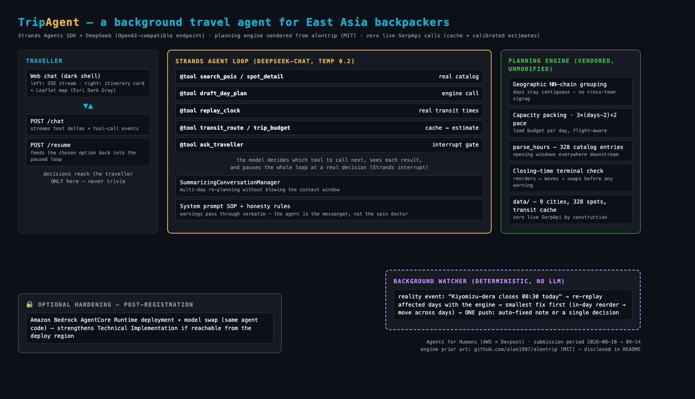

# TripAgent — a background travel agent for East Asia backpackers

> Built for the [Agents for Humans](https://agentsforhumans.devpost.com/) hackathon
> (AWS × Devpost, submission deadline 2026-09-14 5pm PDT).

TripAgent is two products in one:

- **🤖 Agent mode** (default at [`/`](https://alonuniverse.com/trip/)) — describe your
  trip in plain language. A [Strands Agents SDK](https://github.com/strands-agents)
  agent researches real spots, real transit minutes and real opening hours through
  tools, drafts the itinerary through a deterministic planning engine, **pauses only
  when there is a genuine decision to make** (a Strands interrupt), and afterwards
  keeps watching the trip in the background.
- **🧭 Classic mode** (`/classic`) — the original guided form for travellers who
  prefer to pick every spot themselves. Both modes share the same planning engine
  and the same live map.

The agent works; you keep the pen.

## What it does

- **Conversational planning** — the Strands agent looks up real spots, real transit
  minutes and real opening hours through tools, then drafts a day-by-day plan
  (structured output, not free text).
- **Human-in-the-loop at decision points only** — a spot that can't be reached
  before closing, an over-packed pace, an over-budget stay: the agent pauses and
  asks, with concrete options, instead of silently choosing for you.
- **Engine-authoritative output** — every displayed time is produced by the
  deterministic engine (real cached transit legs, closing-time clipping,
  arrival-day starts). The model orchestrates; the engine guarantees. Provenance
  badges on the plan show what is catalog-verified, cached, or estimated.
- **Background watching** — a deterministic watcher (no LLM) re-replays affected
  days when reality changes (an early closure) and pushes ONE notification:
  either "fixed, here's what changed" or a single decision.

## Architecture



Strands agent loop (model of choice — DeepSeek over an OpenAI-compatible endpoint
by default, Bedrock via `AGENT_MODEL=bedrock`) → 8 tools wrapping the native
planning services → FastAPI SSE streaming to a terminal-styled web shell with a
Leaflet map.

## Run it

```bash
python3 -m venv .venv && .venv/bin/pip install -r requirements.txt
cd frontend && npm ci && npm run build && cd ..
cp .env.example .env            # fill DEEPSEEK_API_KEY (agent brain)
cd backend && ../.venv/bin/python -m uvicorn app.main:app --port 5003
# open http://127.0.0.1:5003/trip/            (agent mode web shell)
```

Demos and tests:

```bash
.venv/bin/python -m pytest backend/tests   # 17 offline tests, no API calls
```

## Repository layout

```
backend/app/agents/     Strands agent layer (tools, decisions, factory, provenance)
backend/app/services/   deterministic planning engine (grouping, packing, hours)
backend/tests/          offline regression suite (verdict-flip tests included)
frontend/               terminal-styled web shell (Vue 3 + Leaflet)
docs/                   architecture diagram, engine issues log
```

## Prior art / disclosure

The deterministic planning engine in `backend/app/services/` — geographic
nearest-neighbour grouping, capacity packing, the opening-hours parser (328-entry
catalog audit) and the closing-time terminal check — originated in my earlier
open-source project [alontrip](https://github.com/alon1997/alontrip) (MIT), which
was submitted to a different hackathon (DevNetwork API + Cloud + AI, deadline
2026-09-03) that concluded before this submission period began. It is vendored
into this repository **unmodified, with attribution headers on every file**, and
everything built on top of it — the Strands agent layer, conversation and
interrupt design, background watcher, web shell — was **created new during the
Agents for Humans submission period (2026-09-05 → 2026-09-14)**, in line with the
hackathon rules on disclosed open-source reuse.

## Status (2026-09-13)

- ✅ Devpost entry registered for Agents for Humans; $50 AWS credits approved
- ✅ AWS Builder ID created; server→Bedrock (us-east-1) reachability confirmed
  (Bedrock model access pending AWS allowlisting review — the agent runs on
  DeepSeek over an OpenAI-compatible endpoint in the meantime; Strands'
  model portability makes the swap a one-line change)
- Remaining: record the ≤5 min demo video ([shot list](docs/video-script.md)),
  publish the builder.aws.com build story

## License

MIT — see [LICENSE](LICENSE).
